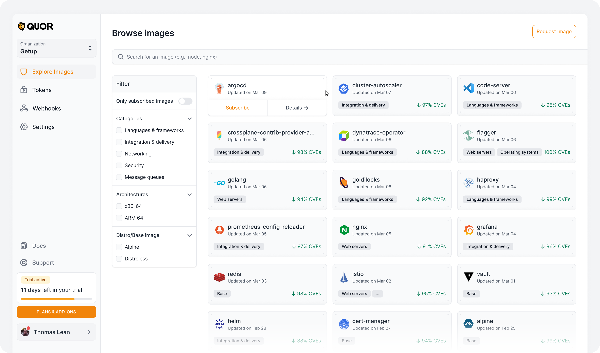
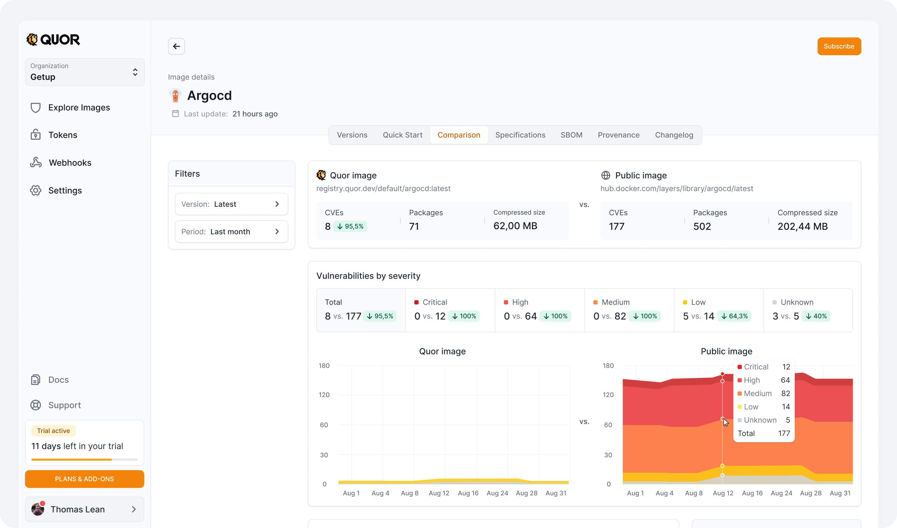
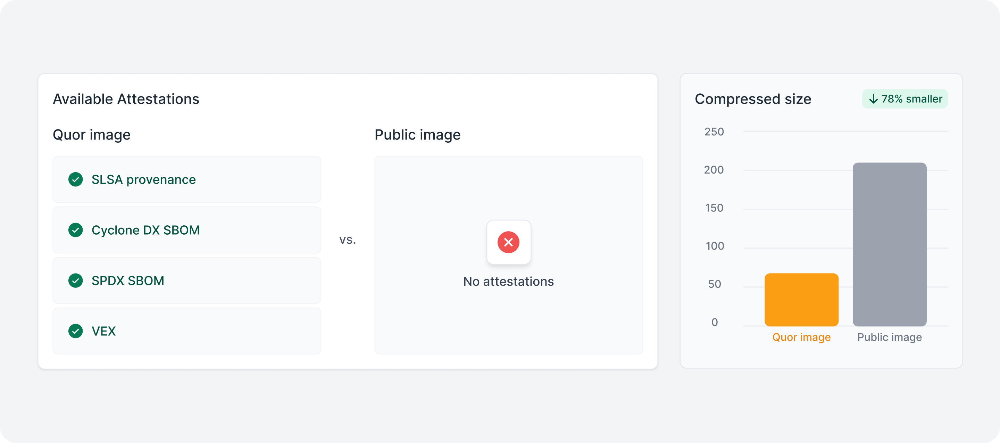
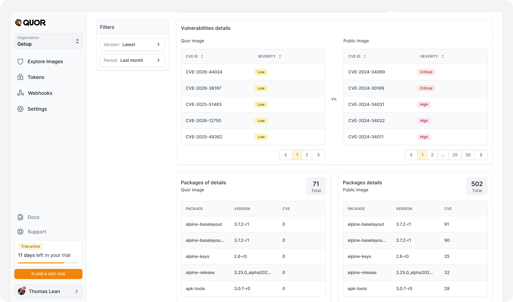
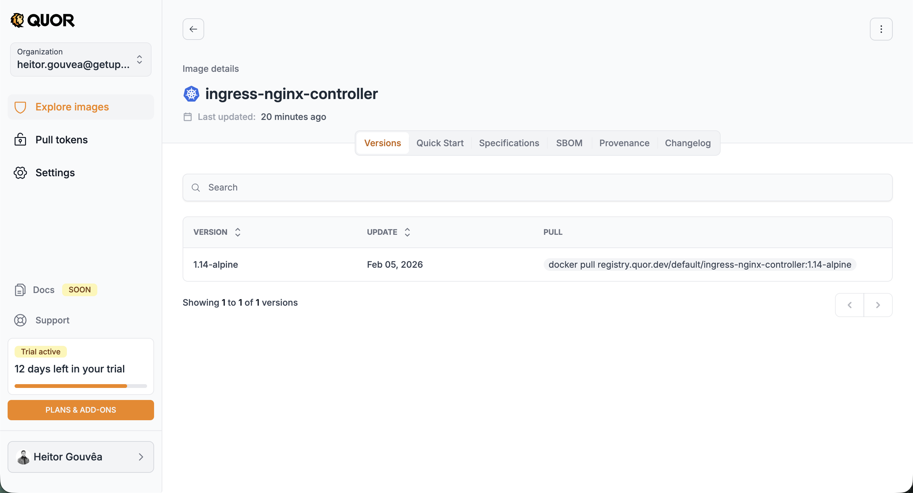
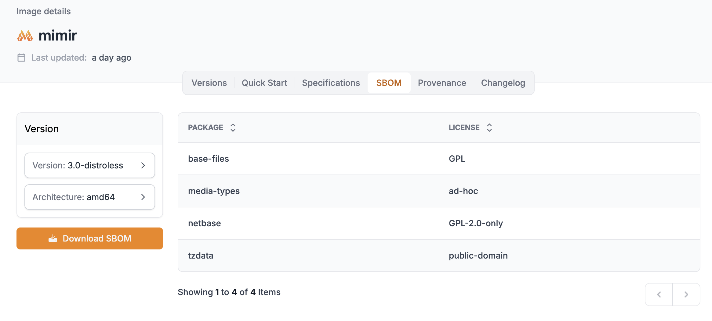
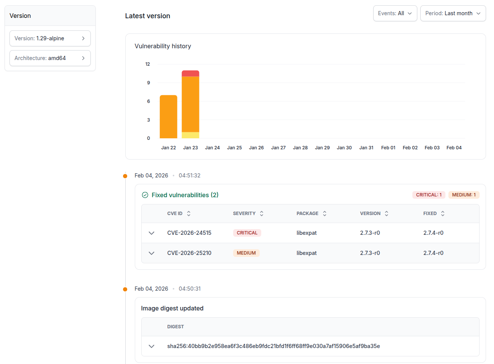

# Image catalog

## Browse images

The Browse images section displays the image catalog as cards, allowing you to quickly identify images and view the percentage reduction in vulnerabilities compared to the public image.

For each image, the following actions are available:

- **Subscribe to image** → for images available in your current plan;
- **Contact us** → for images available only on the Enterprise plan (after the Trial);
- **`docker pull` command** → for images you have already subscribed to and are ready to use.

!!! note "Important"

    The image path (required for `docker pull`) is only displayed after you subscribe to the image.

In addition to the image list, the page provides several options for finding specific images:

- **Text search:** Search for images directly by name (e.g., `node`, `nginx`, `argocd`).
- **Only subscribed images:** Toggle the view to display only images that your organization is actively subscribed to.
- **Categories:** Filter the catalog by use case (_Languages & frameworks_, _Integration & delivery_, _Networking_, _Security_, _Message queues_, etc.).
- **Architectures:** Filter images by processor architecture (_x86-64_, _ARM 64_).
- **Distro/Base image:** Filter images by their base Linux distribution (e.g., _Alpine_, _Distroless_).

## Image comparison

A detailed view of the security posture, size, and composition of the Quor image compared to the corresponding public image.

### **Comparison components**

**Filters:**

- **Version:** Sets the image tag or version to analyze (e.g., Latest).
- **Period:** Sets the time window for the historical chart (e.g., Last month).

**Key metrics:**

Shows the registry URL of each image and compares the following indicators:

- CVEs: Total number of known vulnerabilities and the percentage reduction achieved (e.g., 8 vs. 177, a `⬇ 95.5%` reduction).
- Packages: Number of packages and dependencies installed in each image.
- Compressed size: Compressed image size in megabytes, showing the reduction in transfer and storage usage.

**Vulnerabilities by severity**

Breakdown of vulnerabilities by severity level (_Critical_, _High_, _Medium_, _Low_, _Unknown_):

- Shows a direct comparison of the number of vulnerabilities (Quor vs. Public) and the mitigation percentage achieved at each level (e.g., 0 vs. 12 with a ⬇ 100% reduction in critical vulnerabilities).

**Vulnerability trend charts**  
Two area charts compare the vulnerability history of the Quor image against the public image over the selected period:

- Shows the daily variation in identified CVEs.
- Uses severity-coded colors to show the image's stability over time.

**Attestations and compliance**  
Compares the presence of security attestations and compliance artifacts in each build:

- **Quor image:** Lists active, verified attestations, such as SLSA provenance, CycloneDX SBOM, SPDX SBOM, and VEX statements.
- **Public image:** Indicates the absence of security attestations (_No attestations_).

**Compressed size comparison**  
A dedicated bar chart that visually illustrates the size difference between the two images, showing the exact optimization percentage (e.g., ⬇ 78% smaller).

**Vulnerability**

At the bottom of the screen, side-by-side panels allow a granular audit of the security and composition of the images:

- Vulnerabilities (Vulnerabilities details): Lists each active vulnerability by CVE ID and Severity level (e.g., _Low_, _Critical_, _High_). Pagination makes navigation easier and highlights the stark difference in threat volume (e.g., 2 pages for the Quor image vs. 36 pages for the public image).

!!! note "Access to the SBOM and Provenance tabs"

    For information about the full software composition or build provenance, go to the **SBOM** and **Provenance** tabs.

## Image details

When you click on an image, you access the details page with complete information organized in tabs:

### Versions

Lists all available versions of the image, with update date and `docker pull` command for each one. When clicking on a specific version, you can view its packages and vulnerabilities, as well as scan instructions.

### Quick Start

Quick guide with usage instructions for the image, including deployment examples for Kubernetes, Helm, and Dockerfile.

### Specifications

Technical specifications of the image, such as architecture, size, and configurations.

### SBOM

The **SBOM (Software Bill of Materials)** lists all packages contained in the image, with their respective licenses. You can select the desired version and architecture and download the complete SBOM.

### Provenance

Provenance information for the image, attesting to its origin and integrity.
For all images and versions, this evidence set includes SBOM, signature, provenance attestations, and VEX statements to add exploitability context to vulnerability analysis.

### Changelog

The **Changelog** displays the vulnerability history of the image over time. It includes an evolution graph and a detailed list of detected vulnerabilities, with CVE ID, severity, affected package, version, and fix status.

## Requesting new images

The Quor catalog is continuously expanded, with new images added in regular cycles. Additionally, users can request the inclusion of specific images.

### Request criteria

Requests are evaluated according to the following requirements:

- The project must be open source;
- The license must be compatible with redistribution;
- The requested version must be under active security support (not EOL).

!!! note

    Support verification is based on [endoflife.date](https://endoflife.date).
