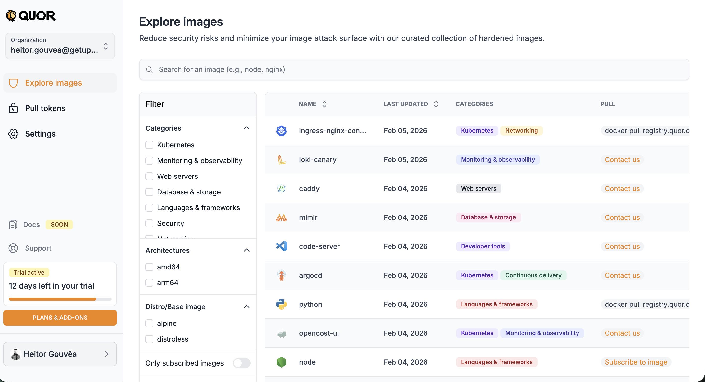
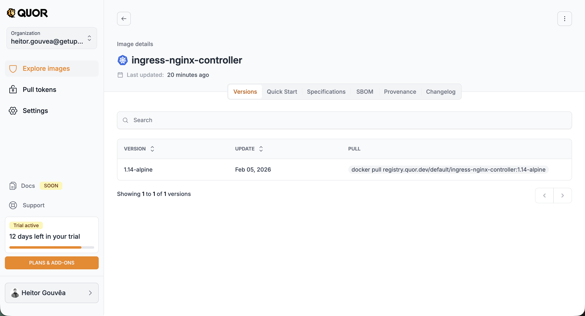
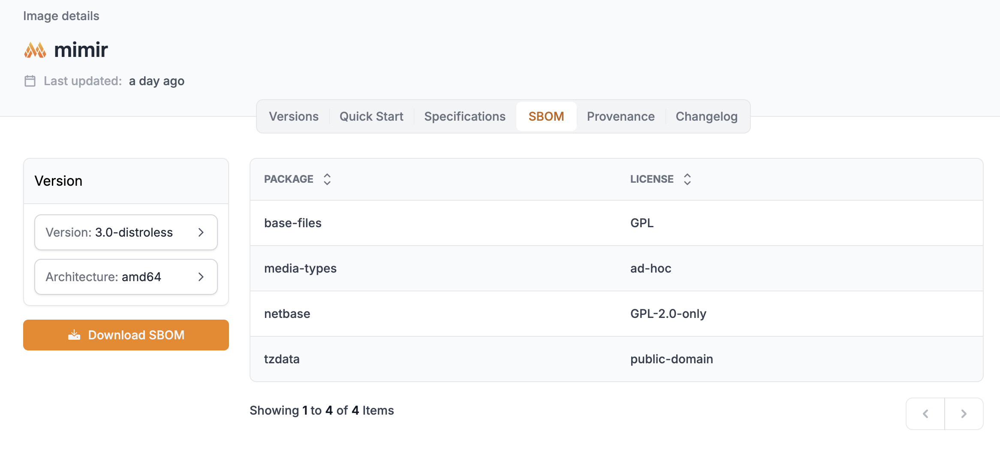
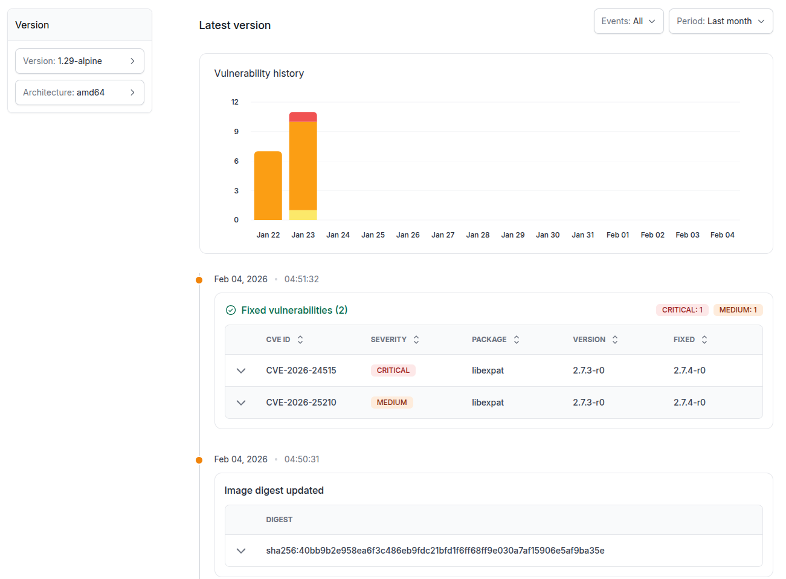

# Catálogo de imagens

## Explore Images

Na sessão **Explore Images**, você tem acesso ao catálogo completo de imagens do Quor.

A lista apresenta, para cada imagem:

- Nome;
- Data da última atualização;
- Categoria(s) (ex.: Kubernetes, Monitoring & Observability);
- Ação disponível (PULL):
    - **Subscribe to image** → para imagens disponíveis no seu plano;
    - **Contact us** → para imagens disponíveis apenas no plano Enterprise (usuários Trial);
    - **Comando docker pull** → para imagens já subscritas e prontas para uso.

!!! note "Importante"

    O path da imagem (necessário para o `docker pull`) só é exibido após a subscrição.

Além da lista, a tela oferece recursos para localizar imagens específicas:

- **Barra de busca**: pesquisa por nome (ex.: nginx, node, prometheus).
- **Filtros laterais**:
    - **Categories**: Kubernetes, Monitoring & Observability, Web servers, Database & storage, Languages & frameworks, Security, Networking;
    - **Architectures**: amd64, arm64;
    - **Distro/Base image**: alpine, distroless.
- **Only subscribed images**: toggle para exibir apenas as imagens já subscritas pela sua organização.

## Detalhes da imagem

Ao clicar em uma imagem, você acessa a página de detalhes com informações completas organizadas em abas:

### Versions

Lista todas as versões disponíveis da imagem, com data de atualização e comando `docker pull` para cada uma. Ao clicar em uma versão específica, é possível visualizar seus pacotes e vulnerabilidades, além de instruções de scan.

### Quick Start

Guia rápido com instruções de uso da imagem, incluindo exemplos de deploy em Kubernetes, Helm e Dockerfile.

### Specifications

Especificações técnicas da imagem, como arquitetura, tamanho e configurações.

### SBOM

O **SBOM (Software Bill of Materials)** lista todos os pacotes contidos na imagem, com suas respectivas licenças. Você pode selecionar a versão e arquitetura desejadas e fazer download do SBOM completo.

### Provenance

Informações de proveniência da imagem, atestando sua origem e integridade.
Para todas as imagens e versões, esse conjunto inclui SBOM, assinatura, atestados de proveniência e declarações VEX para adicionar contexto de explorabilidade na análise de vulnerabilidades.

### Changelog

O **Changelog** exibe o histórico de vulnerabilidades da imagem ao longo do tempo. Inclui um gráfico de evolução e uma lista detalhada das vulnerabilidades detectadas, com CVE ID, severidade, pacote afetado, versão e status de correção.

## Solicitar novas imagens

O catálogo do Quor é expandido continuamente, com novas imagens adicionadas em ciclos regulares. Além disso, usuários podem solicitar a inclusão de imagens específicas.

### Critérios para solicitação

As solicitações são avaliadas de acordo com os seguintes requisitos:

- O projeto deve ser open source;
- A licença precisa ser compatível com redistribuição;
- A versão solicitada deve estar em suporte ativo de segurança (não EOL).

!!! note

    A verificação de suporte é feita com base em [endoflife.date](https://endoflife.date).
