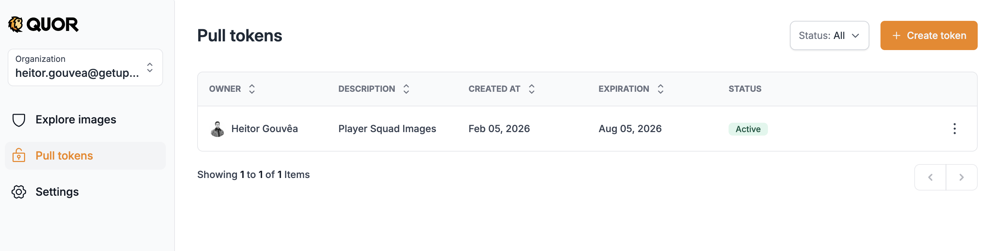
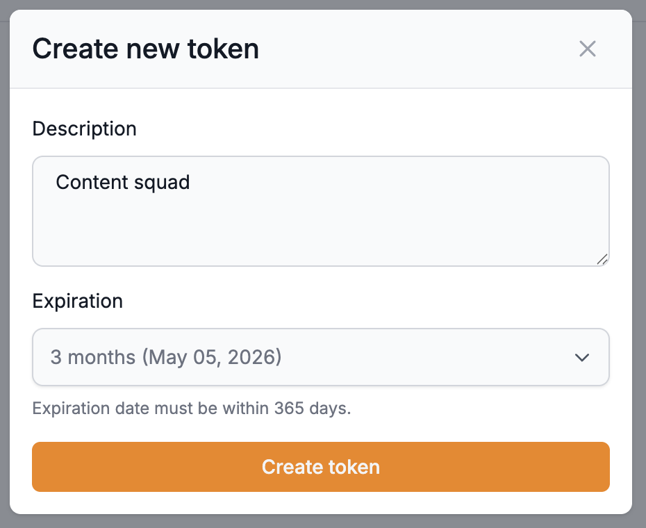
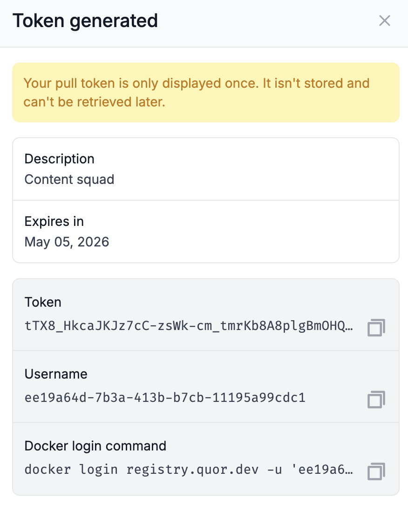

# Começando com o Quor

## Bem-vindo ao Quor

Para começar a usar, acesse a interface do Quor em: [app.quor.dev](https://app.quor.dev)

## Primeiro acesso

No primeiro login (usando GitHub, Microsoft ou Gmail), o Quor automaticamente:

- Cria sua conta de usuário.
- Vincula uma organização ao seu usuário.
- Ativa o plano Trial.
- Cria o grupo de administradores (admin), com todas as permissões para gerenciar a interface.


Após a criação da conta, você passa a ter acesso à interface do Quor e pode visualizar a sessão **Explore Images**.

Nela estão listadas as imagens do catálogo, às quais você pode realizar uma subscrição, incluindo:

- Versões disponíveis da imagem;
- Metadados e especificações técnicas.

!!! note "Importante"

    Para fazer pull ou verificar uma imagem, é necessário ter uma subscrição ativa (Trial ou Enterprise) para a organização, além de criar um token para autenticação.

## Tokens

O token de acesso é a credencial utilizada para autenticar no registro do Quor. Ele é o elemento que autoriza a operação de pull de imagens subscritas e, portanto, deve ser tratado como um segredo.

### Criando um token

1. Logado no Quor, vá até **Pull Tokens**.
2. Clique em **Create Token**.



3. Informe uma descrição para identificar o token.
4. Defina uma data de expiração (obrigatoriamente dentro do período de até 1 ano).



5. Confirme a criação.
6. Após criado, será exibido o comando `docker login`, que contém os dados para autenticação no registry.



!!! warning "Importante"

    - Apenas usuários com permissão de administrador podem gerar tokens.
    - As informações do token são exibidas apenas uma vez no momento da criação; os dados não poderão ser recuperados.
    - Se o token for perdido ou exposto, será necessário revogá-lo e criar um novo.

## Autenticação no registry com docker login

Para acessar e baixar imagens do Quor, é necessário autenticar-se no registro do Quor, localizado em: `registry.quor.dev`

Autentique-se no registro do Quor usando o comando exibido no campo **docker login command** no momento da criação do token. Esse comando mantém sua sessão ativa até que o token expire, sem necessidade de usar um token inline.

**Exemplo:**

```bash
docker login registry.quor.dev -u '<USERNAME>' -p '<TOKEN>'
```

Uma vez autenticado, você pode fazer pull de qualquer imagem incluída na sua subscrição (Trial ou Enterprise).

## Obtendo o path da imagem

Após realizar a subscrição de uma imagem, o path correspondente é exibido na interface do Quor. Esse path deve ser copiado e utilizado nos comandos `docker pull` para baixar a imagem.

**Exemplo:**

```bash
docker pull registry.quor.dev/default/<IMAGE>:<TAG>
```

!!! note

    Quando o token expirar, será necessário executar novamente o `docker login` com um token válido para continuar trabalhando.

## Quick Start: Exemplo com imagem Caddy

A seguir, um exemplo prático de como utilizar uma imagem segura do Quor em seu ambiente.

### Requisitos

Para acessar esta imagem, sua organização deve ter:

- Um plano Quor ativo com subscrições de imagem disponíveis.
- Uma subscrição para a imagem desejada (clique em "Subscribe to image").
- Um Pull Token válido, já configurado no seu Docker CLI (`docker login`).

### Uso

Comece fazendo pull da imagem caddy usando qualquer versão disponível na aba Versions:

```bash
docker pull registry.quor.dev/default/caddy:2.10-alpine
```

Para ambientes de produção, recomendamos hospedar a imagem no registry da sua própria organização ou configurar um mirror.

Para copiar a imagem de container junto com suas attestations e assinaturas, use `cosign` em vez do tradicional `docker tag` + `docker push`:

```bash
cosign copy registry.quor.dev/default/caddy:2.10-alpine <YOUR-REGISTRY>/caddy:2.10-alpine
```

### Exemplos de deploy

Abaixo estão exemplos mostrando como esta imagem pode ser implantada no Kubernetes ou outros ambientes. Substitua todos os placeholders (`<...>`) com valores específicos do seu ambiente.

**Atualizar um Deployment no Kubernetes:**

```bash
kubectl set image deployment/caddy <CONTAINER-NAME>=<YOUR-REGISTRY>/caddy:2.10-alpine
```

**Upgrade de um Helm Release:**

```bash
helm upgrade <RELEASE-NAME> <CHART> \
  --set path.to.repository=<YOUR-REGISTRY>/caddy \
  --set path.to.tag=2.10-alpine \
  --wait --reuse-values
```

**Imagem base em um Dockerfile:**

```dockerfile
FROM <YOUR-REGISTRY>/caddy:2.10-alpine
```

### Próximos passos

Para uma experiência tranquila e segura:

- **Valide a imagem** no seu ambiente para garantir que ela atende aos seus requisitos operacionais e de segurança.
- **Mantenha a imagem atualizada** para se beneficiar das últimas correções de segurança e melhorias.

Para quaisquer problemas, dúvidas ou feedback, [entre em contato](https://quor.dev).
