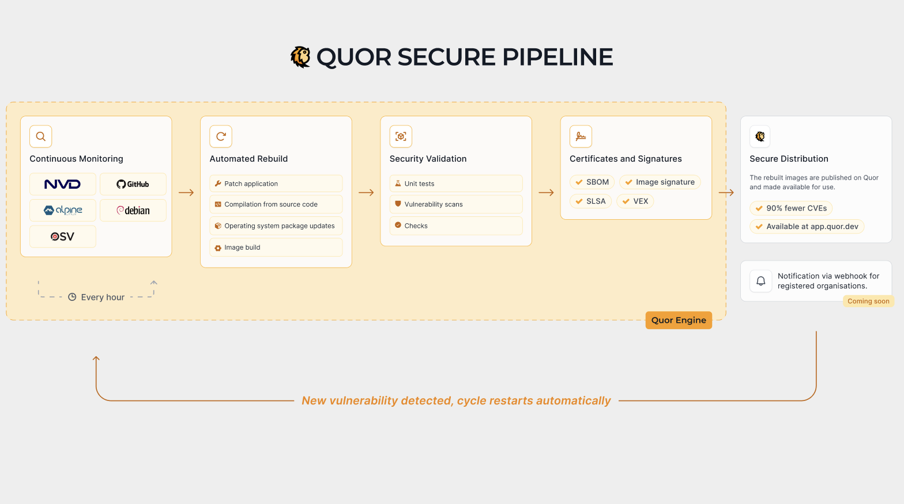

# Quor internal architecture

This page provides a high-level and more descriptive view of how Quor identifies vulnerable images, rebuilds them from source code, and keeps the catalog close to zero known CVEs over time.

## Architecture goal

Quor is designed to solve a practical operational problem: teams need container images that are secure by default, continuously maintained, and ready to use in production without constant manual CVE triage.

To achieve this, Quor treats image security as a continuous lifecycle instead of a one-time scan.

## Main architecture blocks

At a high level, the architecture can be understood in four blocks:

1. **Vulnerability intelligence and correlation**  
   Quor continuously ingests vulnerability information and correlates CVEs with affected packages and image versions.

2. **Source-first image factory**  
   For remediation, Quor rebuilds images directly from source code with controlled inputs, instead of relying only on upstream prebuilt binaries.

3. **Security validation and attestations**  
   Each build is validated through vulnerability scans and policy checks, then accompanied by security artifacts such as SBOMs, signatures, and provenance metadata.

4. **Registry publication and feedback loop**  
   Approved images are published to the Quor registry and kept under continuous monitoring, so newly disclosed CVEs can trigger a new remediation cycle.

## Security strategy by design

Before remediation starts, Quor reduces risk structurally:

- Prefer minimal bases such as Alpine and distroless when compatible with runtime requirements
- Remove unnecessary OS packages and tooling from runtime images
- Keep runtime images focused on execution-only dependencies

This directly lowers attack surface, scanner noise, and exploitability options after initial compromise.

## End-to-end flow

The flow is iterative and continuously repeated:

1. **Detect risk**
   - Identify newly disclosed CVEs and map them to catalog images.
   - Locate the exact vulnerable component (package, dependency, or layer).

2. **Plan remediation**
   - Decide whether to update, patch, or replace the vulnerable component.
   - Define the safest path to reduce exposure while preserving expected behavior.

3. **Rebuild from source**
   - Build updated components and image layers from source code.
   - Keep the image minimal to reduce attack surface and unnecessary packages.

4. **Validate and attest**
   - Re-scan the image for known vulnerabilities.
   - Generate and publish SBOM, signature, and provenance artifacts.

5. **Publish and monitor**
   - Release the updated image version in the Quor registry.
   - Continue monitoring for newly disclosed CVEs and restart the cycle when needed.

## Patch-gap reduction model

A common supply-chain delay happens between:

1. Security fix merged upstream
2. Distribution package update
3. Base image rebuild
4. Language image rebuild
5. Application image rebuild and deploy

This delay ("patch gap") can last days or weeks in typical ecosystems.

Quor reduces that gap by rebuilding directly from upstream source commits when security-relevant changes are validated.
This removes dependency on multiple intermediate release cadences and accelerates remediation delivery.

## Evidence model: SBOM, provenance, SLSA, and VEX

Quor publishes layered evidence for each image version:

- **SBOM**: what components are present
- **Signature**: image integrity and publisher identity
- **Provenance attestation**: how/where/by whom the artifact was built
- **SLSA-aligned controls**: process maturity and build hardening
- **VEX statements**: whether a reported CVE is exploitable in that exact image context

This model supports risk decisions based on verifiable context, not only raw CVE matching.

## VEX in the operational loop

Scanner output alone cannot determine exploitability.
Quor uses VEX statements to classify CVEs with auditable technical justification, including statuses such as:

- `not_affected`
- `affected`
- `fixed`
- `under_investigation`

By shipping this context with the image evidence, CI/CD pipelines can suppress non-actionable alerts and prioritize real risk.

## Why rebuilding from source matters

- **Remediation speed**: fixes are not blocked by external image release timing.
- **Tighter control**: build inputs and resulting artifacts are controlled and auditable.
- **Lower residual risk**: minimal images and continuous revalidation reduce long-term vulnerability accumulation.

The outcome is a practical security baseline for platform and application teams: production-ready images that stay at zero or near-zero known CVEs for as long as possible.
