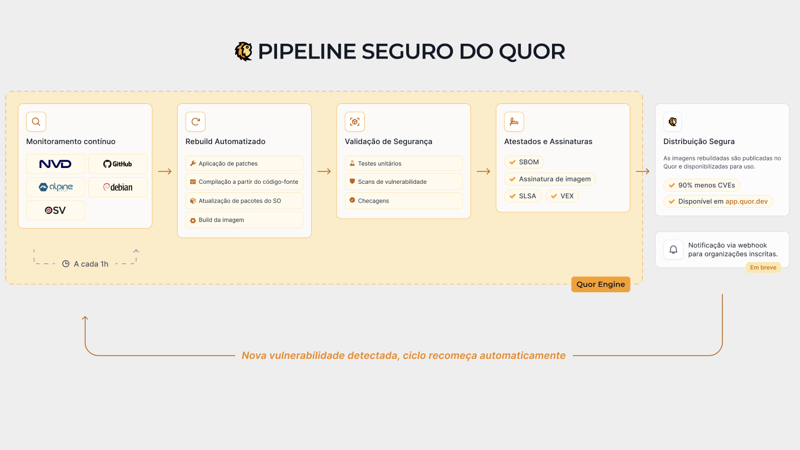

# Arquitetura interna do Quor

Esta página traz uma visão de alto nível, mais descritiva, de como o Quor identifica imagens vulneráveis, recompila imagens a partir do código-fonte e mantém o catálogo próximo de zero CVEs conhecidas ao longo do tempo.

## Objetivo da arquitetura

O Quor foi desenhado para resolver um problema operacional real: equipes precisam de imagens de container seguras por padrão, mantidas continuamente e prontas para produção, sem depender de triagem manual constante de CVEs.

Para isso, o Quor trata segurança de imagens como um ciclo contínuo, e não como um scan isolado.

## Blocos principais da arquitetura

Em alto nível, a arquitetura pode ser entendida em quatro blocos:

1. **Inteligência de vulnerabilidades e correlação**  
   O Quor coleta continuamente informações de vulnerabilidades e correlaciona CVEs com pacotes e versões de imagem afetadas.

2. **Fábrica de imagens orientada a código-fonte**  
   Para remediação, o Quor recompila imagens diretamente do código-fonte com insumos controlados, em vez de depender somente de binários prontos do upstream.

3. **Validação de segurança e atestações**  
   Cada build é validado com scans e políticas de segurança, além de gerar artefatos como SBOM, assinaturas e metadados de proveniência.

4. **Publicação no registry e ciclo de feedback**  
   As imagens aprovadas são publicadas no registry do Quor e ficam em monitoramento contínuo, para que novas CVEs acionem um novo ciclo de remediação.

## Estratégia de segurança por design

Antes mesmo da remediação, o Quor reduz risco de forma estrutural:

- Prioriza bases mínimas como Alpine e distroless quando compatível com o runtime
- Remove pacotes e ferramentas desnecessárias da imagem final
- Mantém a imagem de runtime focada apenas no necessário para execução

Isso reduz superfície de ataque, ruído de scanner e opções de pós-exploração.

## Fluxo ponta a ponta

O fluxo é iterativo e se repete continuamente:

1. **Detectar risco**
   - Identificar CVEs recém-divulgadas e mapear impacto no catálogo.
   - Localizar exatamente o componente vulnerável (pacote, dependência ou camada).

2. **Planejar remediação**
   - Definir se o componente deve ser atualizado, corrigido por patch ou substituído.
   - Escolher o caminho mais seguro para reduzir exposição sem quebrar o comportamento esperado.

3. **Recompilar a partir do código-fonte**
   - Gerar componentes atualizados e novas camadas de imagem a partir de source.
   - Manter imagens mínimas para reduzir superfície de ataque e pacotes desnecessários.

4. **Validar e atestar**
   - Executar novo scan para vulnerabilidades conhecidas.
   - Gerar e publicar SBOM, assinatura e informações de proveniência.

5. **Publicar e monitorar**
   - Liberar a nova versão da imagem no registry do Quor.
   - Continuar monitorando novas CVEs e reiniciar o ciclo quando necessário.

## Modelo de redução de patch gap

Um atraso comum na supply chain acontece entre:

1. Merge do fix no upstream
2. Atualização do pacote na distribuição
3. Rebuild da imagem base
4. Rebuild da imagem de linguagem
5. Rebuild/deploy da imagem da aplicação

Esse atraso ("patch gap") pode durar dias ou semanas.

O Quor reduz esse gap ao recompilar diretamente de commits upstream relevantes para segurança, após validação.
Com isso, reduz a dependência de múltiplos cronogramas intermediários de release.

## Modelo de evidência: SBOM, proveniência, SLSA e VEX

Para cada versão de imagem, o Quor publica camadas de evidência:

- **SBOM**: quais componentes existem na imagem
- **Assinatura**: integridade do artefato e identidade de publicação
- **Atestado de proveniência**: como/onde/por quem o build foi produzido
- **Controles alinhados a SLSA**: maturidade e robustez do processo
- **Declarações VEX**: se uma CVE reportada é explorável naquele contexto exato

Esse modelo permite decisões de risco baseadas em contexto verificável, e não apenas em matching bruto de CVE.

## VEX no ciclo operacional

Scan isolado não determina explorabilidade.
O Quor usa declarações VEX com justificativa técnica auditável, incluindo status como:

- `not_affected`
- `affected`
- `fixed`
- `under_investigation`

Ao publicar esse contexto junto com os artefatos da imagem, pipelines de CI/CD conseguem suprimir alertas não acionáveis e priorizar risco real.

## Por que recompilar do código-fonte importa

- **Velocidade de remediação**: correções não ficam presas ao tempo de release de imagens externas.
- **Mais controle**: insumos de build e artefatos resultantes ficam sob controle e auditáveis.
- **Menor risco residual**: imagens mínimas e revalidação contínua reduzem acúmulo de vulnerabilidades no tempo.

O resultado é uma base prática de segurança para times de plataforma e aplicação: imagens prontas para produção que permanecem em zero ou próximo de zero CVEs conhecidas pelo maior tempo possível.
