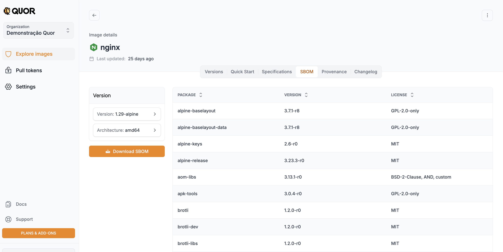
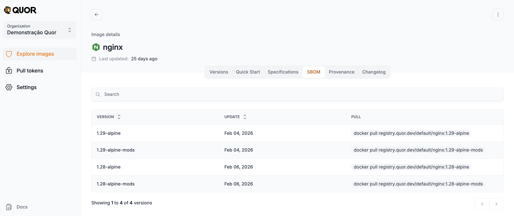

# SBOM

## Introdução

SBOM (Software Bill of Materials) é um inventário estruturado da composição de um artefato de software.
Não é apenas uma lista de dependências. Uma SBOM útil para produção inclui metadados como:

- Nome e versão de cada componente
- Fornecedor/origem
- Licença
- Hashes criptográficos
- Relações de dependência
- Identificadores padronizados (como PURL e CPE)

Na prática, o conteúdo pode ser modelado como um grafo de dependências, permitindo análise transitiva de impacto e correlação contínua com vulnerabilidades.

Os formatos mais usados no mercado são SPDX e CycloneDX.

## Por que SBOM é estrutural para segurança

Em incidentes como Log4Shell, a pergunta mais importante não é "temos scanner?", e sim:

- Onde esse componente está presente?
- Quais versões de imagem são impactadas?
- O que já foi corrigido?

Sem SBOM, essa resposta costuma exigir busca manual e reconstrução de contexto.
Com SBOM, o inventário já está materializado e pode ser reavaliado continuamente contra bases como NVD, OSV e GHSA, sem necessidade de recompilar a imagem.

Isso reduz ruído e acelera resposta.

## SBOM no Quor

No Quor, a SBOM é gerada durante o build e publicada para cada versão da imagem como parte do conjunto de evidências de segurança.
Ela é distribuída junto com assinaturas e metadados de proveniência.

Para acessar e baixar:

1. Abra o catálogo de imagens.
2. Clique na imagem desejada.
3. Na página de detalhes, acesse a aba **SBOM**.
4. Selecione a versão e a arquitetura.
5. Faça o download do SBOM completo.

## Relação com VEX, proveniência e SLSA

A SBOM responde **o que compõe** a imagem.
Ela não responde sozinha:

- Se uma CVE é explorável naquele contexto
- Como a imagem foi construída e por qual identidade
- Qual nível de garantia de supply chain o processo oferece

Por isso, a SBOM deve ser consumida junto com:

- **VEX**: status de explorabilidade por CVE com justificativa técnica (`not_affected`, `affected`, `fixed`, `under_investigation`)
- **Atestados de proveniência**: evidência verificável de origem do build (repositório, commit, builder, timestamp)
- **Controles alinhados a SLSA**: maturidade do pipeline de build e publicação

Esse encadeamento transforma inventário em evidência auditável de confiança.

## Nota prática: scan de SBOM vs scan da imagem OCI

Em muitos pipelines, escanear a SBOM já gerada é mais eficiente do que reescanear toda a imagem OCI em cada execução.
Como o inventário de pacotes já está enumerado, o scanner pode focar diretamente na correlação de vulnerabilidades.
Isso melhora escala e desacopla build de análise de risco.

## Escopo e limitações

SBOM é essencial, mas não cobre tudo:

- Foca principalmente na composição de terceiros
- Não substitui SAST/DAST, threat modeling nem revisão de código
- Não prova autenticidade sem assinatura/atestado vinculados ao artefato

No Quor, SBOM é um bloco central dentro de uma arquitetura maior orientada a evidências.
