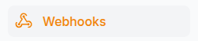
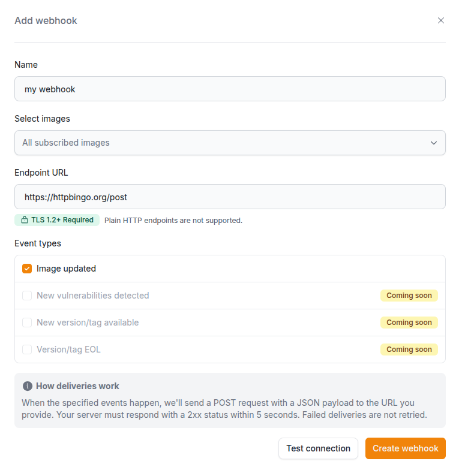
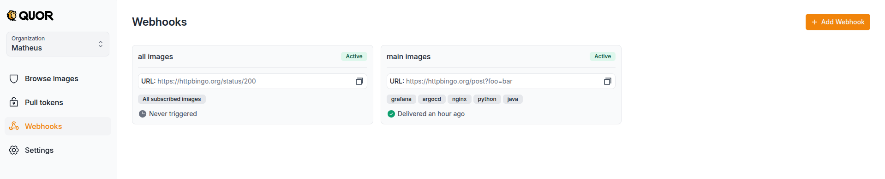
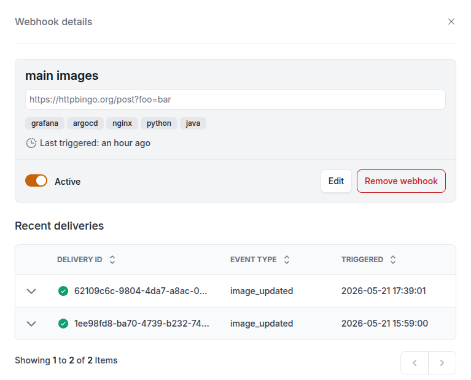
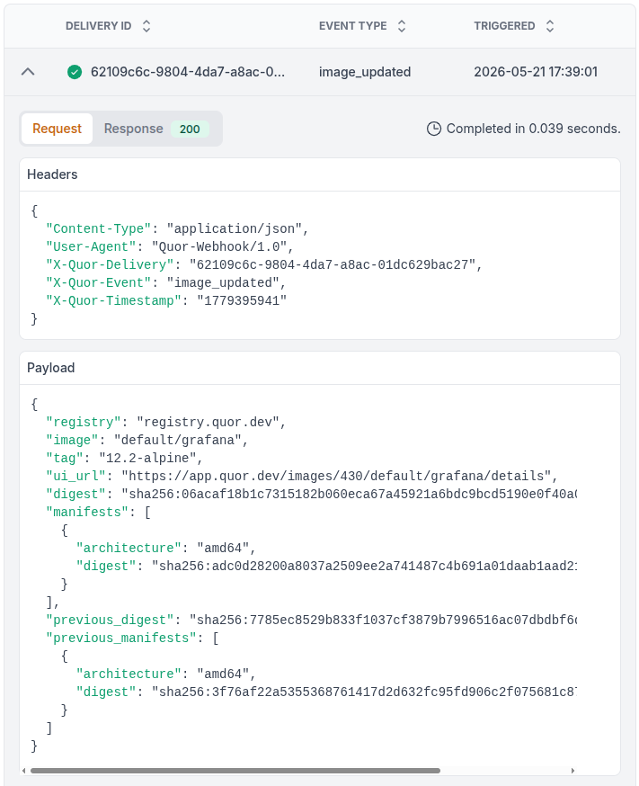

# Webhooks

Webhooks allow external services to be notified when events happen in Quor. 
This can be used to automate workflows or trigger actions outside the platform.

A common use case is being notified when a subscribed image is updated, 
so you can rebuild or redeploy workloads using the latest version. 
This helps avoid continuing to run outdated images even after vulnerabilities have been fixed.

## How it works

When one of the selected events happens, Quor sends an HTTPS POST request with a JSON payload to the URL configured for the webhook.

Your server must:

- Listen on HTTPS (plain HTTP is not supported)
- Support TLS 1.2+
- Respond with a 2xx status within 5 seconds
- Be publicly reachable (internal/private IPs are rejected after DNS resolution)

Additional behavior:

- Deliveries are not retried automatically
- Only the first 10 KB of the response body is stored for debugging purposes. Non-text responses are not stored.

## Supported events

Currently supported:

- **Image updated** — triggered when any version/tag of a subscribed image is updated.

Coming soon:

- New vulnerabilities
- New versions
- End of Life (EOL)

## Creating a webhook

1. On Quor, navigate to **Webhooks** from the left sidebar.
    
    
   
2. Click **Add webhook**.
    
    
    
3. Enter a name to help identify the webhook and a valid HTTPS URL
4. Select which subscribed images and events should trigger the webhook.
5. Optionally click **Test connection** to validate the endpoint before saving.
6. Create the webhook.



Once created, Quor will notify your endpoint whenever the selected events occur for the specified images.

## Managing webhooks

All configured webhooks in your organization are listed in the Webhooks page.



By opening a webhook, you can:

* Edit configuration
* Enable or disable deliveries
* Delete the webhook
* View recent deliveries

## Listing deliveries

Recent deliveries are displayed at the bottom of the webhook details page.



By opening a delivery, you can inspect the complete request and response information, 
including request and response details (body, headers, status).



## Payload

The payload contains both the previous and current image digests, 
making it possible to identify changes at both the image index level and the architecture-specific manifest level.

```json
{
  "registry": "registry.quor.dev",
  "image": "default/image",
  "tag": "1.2-alpine",
  "ui_url": "https://app.quor.dev/images/123/default/image/details",
  "digest": "sha256:843b9c5e4dd478148afceeb6a8f2b0797fe041dbf88b38954d345e2618162c36",
  "manifests": [
    {
      "architecture": "amd64",
      "digest": "sha256:0b98bc2ee3ff2010ff6c0042e27b254f6f3ad7590bb84d259f8a4483f57fb2ae"
    }
  ],
  "previous_digest": "sha256:ee25cd7ca070d8672563a17e030016ec2561cb7293008598b54eed85300d1a55",
  "previous_manifests": [
    {
      "architecture": "amd64",
      "digest": "sha256:e5b5f72a2b189a3292f78b8a3502e74ae8c5294946e62fcb5ee08e2b6e84adae"
    }
  ]
}
```

## Availability

Webhook limits depend on your organization plan:

| Plan            |  Webhooks |
|-----------------|----------:|
| Trial (14 days) |         1 |
| Free            |         0 |
| Enterprise      | Unlimited |
